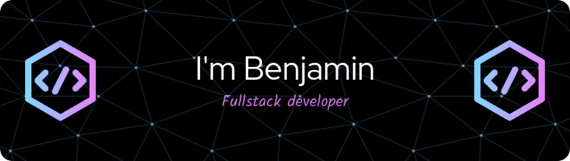

I am a **passionate fullstack developer** 💻
I love **building clean, scalable applications** 🚀

**Ex PhD Scientist** — once working on how to beat cancer

**Fullstack Web Developer** working with :

🔥 **With skills in :**

🔎 **Where to find me:**

